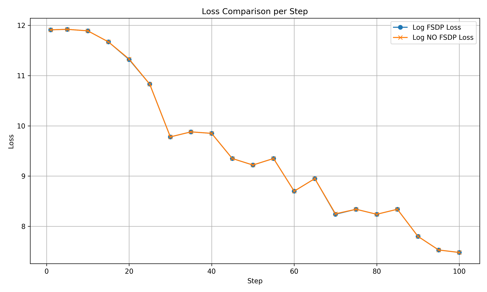
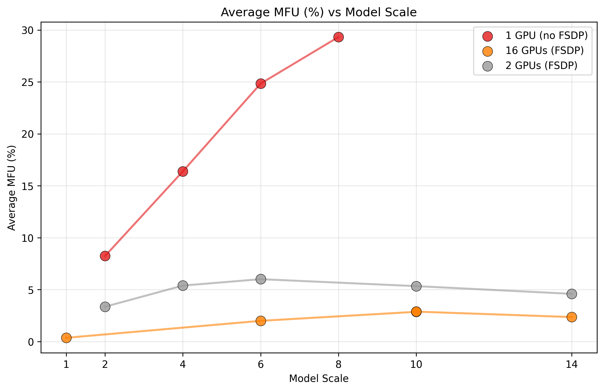
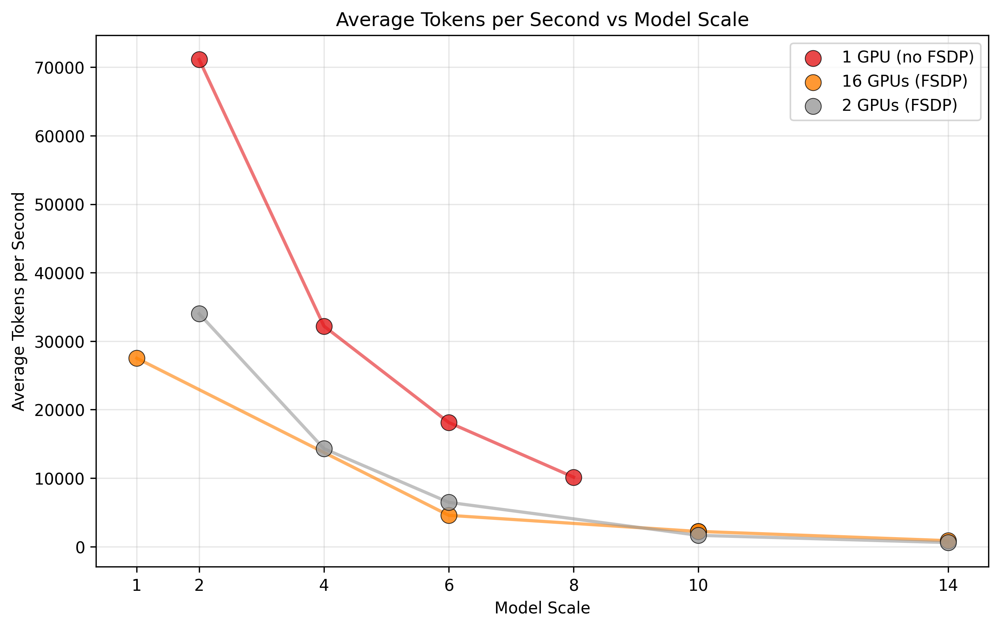
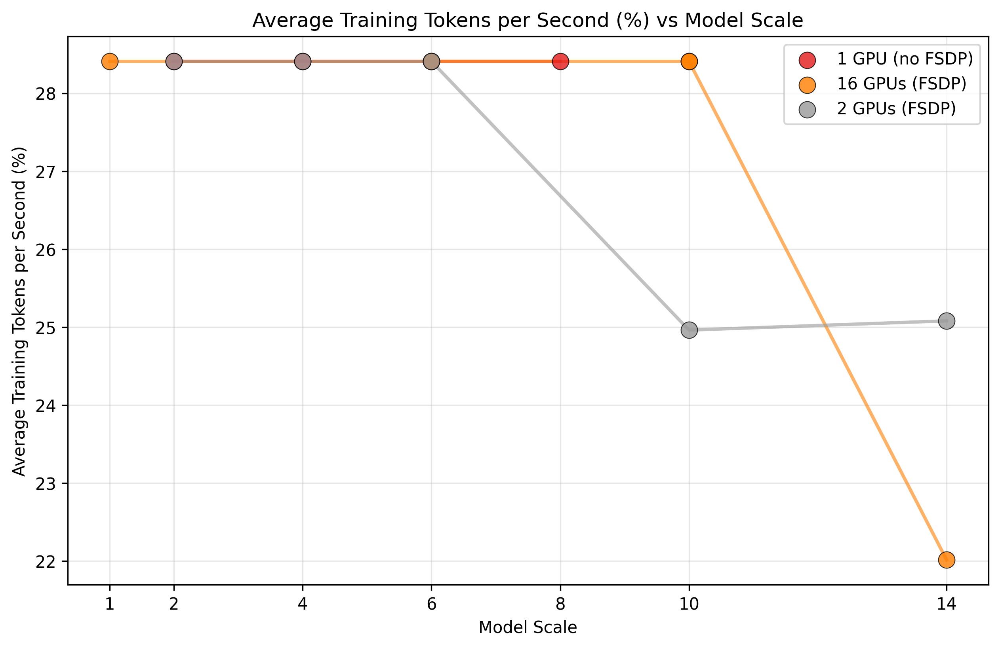

# Large Scale AI Engineering – FSDP Project

This repository contains the project for the ETH course **Large Scale AI Engineering**. It implements **Fully Sharded Data Parallel (FSDP)** training for a Transformer model and runs experiments on a multi-GPU cluster.


## Project Structure
- `sbatch_files/` — contains Slurm job scripts

- `*.py` — training, evaluation, and model code

-  `logs/` — output logs (written per job)


## Introduction

Fully Sharded Data Parallel (FSDP) is a distributed training paradigm introduced by Meta AI that enables efficient training of large AI models by sharding model parameters, gradients, and optimizer states across all participating GPUs. Unlike Distributed Data Parallel (DDP) which replicates the full model on each device, FSDP stores only a fraction ($1/N$ for $N$ GPUs) of parameters on each GPU during idle periods, dramatically reducing memory requirements. During computation, FSDP employs a communication strategy where parameters are gathered only when needed for the forward or backward pass and immediately released afterward. This approach addresses key limitations in scaling model training: GPU memory constraints that prevent fitting billion-parameter models, communication bottlenecks from parameter synchronization, and suboptimal resource utilization.

Our project implements FSDP with three primary experimental objectives: (1) establish baseline memory constraints by finding the maximum model size that fits on a single GPU without FSDP; (2) validate FSDP correctness through loss ablation studies comparing training with and without FSDP on identical model architectures; and (3) analyze scaling behavior by measuring throughput and memory consumption as model size increases when using FSDP. Through memory profiling and performance tracing, we aim to quantify the memory efficiency gains and potential computational overhead introduced by FSDP's communication patterns. These experiments will demonstrate how FSDP enables training of significantly larger models than would otherwise be possible with our available GPU resources while maintaining training integrity.

## Getting Started
 Since `#SBATCH` directives do not expand shell variables like `$USER`, to ensure a smooth running you first need to export your username as an environment variable `$MY_USER` by running:
 ```bash
 $ export MY_USER=your_clariden_username
 ```

 You can verify that it's set by running: 
 ```bash
 $ echo $MY_USER
 ```

 Then to submit any sbatch script that uses `$MY_USER` in the directives, simply run:
 ```bash
envsubst '$MY_USER' < sbatch_files/your_sbatch_script.sh | sbatch
 ```

 Otherwise it won't work unless we hardcode usernames which we don't want to!

## Creating `sbatch` files
Please, create `sbatch` files only inside the `sbatch_files` folder. 
Specify a separate directory for logs that would contain outputs for this job only, e.g. `fsdp-experiments` inside `logs` folder. 
Don't hardcode any usernames in your `sbatch` files, use `$MY_USER` instead.

Here is an example of an `sbatch` script: 
```bash
#!/bin/bash

#!/bin/bash

#SBATCH --account=a-large-sc
#SBATCH --partition=normal
#SBATCH --time=00:14:59
#SBATCH --job-name=lsai
#SBATCH --output=/iopsstor/scratch/cscs/$MY_USER/lai-proj/logs/loss_ablation_fsdp/%x-%j.out
#SBATCH --nodes=2
#SBATCH --ntasks=2 # should match the --nodes parameter
#SBATCH --gpus-per-node=2 # should be up to 4, based on our hardware
#SBATCH --cpus-per-task=72
#SBATCH --mem=460000 # set to maximum to load the biggest models into CPU 
#SBATCH --environment=/iopsstor/scratch/cscs/$MY_USER/ngc_pt_jan.toml     # Vanilla 25.01 PyTorch NGC Image 
#SBATCH --no-requeue	# Prevent Slurm to requeue the job if the execution crashes (e.g. node failure) so we don't loose the logs

set -eo pipefail

echo "START TIME: $(date)"

# Set up ENV
export OMP_NUM_THREADS=$SLURM_CPUS_PER_TASK
ASSIGNMENT_DIR="/iopsstor/scratch/cscs/$MY_USER/lai-proj"

# https://gitlab.uzh.ch/s3it/docs/-/blob/issue80/docs/cluster/python_gpu_example.md?ref_type=heads
# Node networking section
head_node_ip=$(hostname --ip-address)
echo Node IP: $head_node_ip

srun torchrun \
    --nnodes $SLURM_JOB_NUM_NODES \
    --nproc_per_node $SLURM_GPUS_PER_NODE \
    --rdzv_id $RANDOM \
    --rdzv_backend c10d \
    --rdzv_endpoint $head_node_ip:29505 \
    $ASSIGNMENT_DIR/train_fsdp.py \
      --sequence-length 4096 \
      --batch-size 1 \
      --learning-rate 5e-5 \
      --lr-warmup-steps 100 \
      --training-steps 100 \
      --scaling-factor 10 \
      --scaling-strategy all \
      --set-seed 42

echo "END TIME: $(date)"

```

## Scaling strategy 

To run FSDP experiments, we need to control the model's scale to determine how large a model we can train and how it affects overall performance.  
We implement two scaling strategies: `--scaling-strategy all` and `--scaling-strategy n_layers`, which can be passed as arguments to `train.py` or `train_fsdp.py`.

The first strategy scales all parameters (`dim`, `n_layers`, `n_heads`) simultaneously, starting with a minimal example (`dim=256`, `n_layers=8`, `n_heads=8`). This approach allows us to achieve a more or less balanced architecture at any scale.

The second strategy scales only the number of layers (starting with `n_layers=32`), keeping the other parameters at their default values. This allows for finer-grained control over the model's size, as only one factor is varied.

**Implementation**: `model.py`

## FSDP implementation
Similar to `train.py`, we provide `train_fsdp.py`, which supports FSDP. 
We used the following sources to ensure correct implementation:

-[PyTorch Tutorial](https://docs.pytorch.org/tutorials/intermediate/FSDP_advanced_tutorial.html) \
-[Ohio Supercomputer Center Tutorial](https://www.osc.edu/resources/getting_started/howto/howto_pytorch_fully_sharded_data_parallel_fsdp) \
-[Medium Tutorial](https://medium.com/@kyeg/unlock-multi-gpu-finetuning-secrets-huggingface-models-pytorch-fsdp-explained-a58bab8f510e) \
-[UZH Example Installations for Python-based Machine Learning Programming on GPU Nodes](https://gitlab.uzh.ch/s3it/docs/-/blob/issue80/docs/cluster/python_gpu_example.md?ref_type=heads)

**Implementation**: `train_fsdp.py` \
**Sbatch file**: `sbatch_files/train_fsdp.sh` \


## Experiment 1: maximum model size that fits on a single GPU without FSDP 

First, we establish the biggest model that can fit into a single GPU wihtout FSDP. For that we run a binary search scaling model's parameters until we find the best fit. We also implemented another scaling strategy that only changes the number of layers, allowing for more flexibility and therefore fitting a bigger model at the expense of its architecture. 

**Results**:
Scaling all parameters, the biggest model has **46,322,328,320** parameters, achieved with scaling_factor=19 (dim=4864, n_layers=152, n_heads=152). Scaling only the number of layers, the biggest model has **48,185,937,920** parameters, achieved with dim=4096, n_layers=216, n_heads=32. We decided to conduct all the future experiments with only one scaling strategy (scalign all parameters) to 

**Implementation**: `load_model_no_fsdp.py` \
**Sbatch file**: `sbatch_files/load_model_no_fsdp.sh` \
**Log files**: `logs/load_model_no_fsdp/lsai-453992.out` (scaling all parameters), `logs/load_model_no_fsdp/lsai-454054.out` (scaling only the number of layers)

However, fitting a model into a single GPU doesn't guarantee that there is enough memory to train it. We were only able to scale the model up to 9 times (`--scaling-strategy all`) in a way that still allowed training without encountering an OOM (Out of Memory) error.

## Experiment 2: loss ablation with FSDP and without FSDP 
To prove the correctness of FSDP implementation, we fix the seed and train the same model with FSDP (trained on 2 nodes with 4 GPUs each) or without FSDP. Then we compare the loss values parsed from the log files.  

**Results**:

```
=== Max Loss Difference ===
Step: 20
Log FSDP Loss: 11.3200
Log NO FSDP Loss: 11.3300
Absolute Difference: 0.0100

=== Mean Metrics ===
Log FSDP:
  tokens_per_sec: 4814.07
  training_tokens_pct: 27.98
  mfu: 6.08
  tflops: 60.09
Log NO FSDP:
  tokens_per_sec: 7515.06
  training_tokens_pct: 23.94
  mfu: 39.16
  tflops: 387.34
```

As we can see, the results are indentical (with the biggest difference in loss values of 0.01) proving the correct implementation of FSDP. 

**Implementation**: `loss_ablation.py` \
**Reproduction**: \
Activate a conda environment:
```bash
$ conda activate 
```

And run: 
```bash
$ python loss_ablation.py --fsdp-logs=/users/elyulina/scratch/lai-proj/logs/loss_ablation_fsdp/lsai-454149.out --no-fsdp-logs=/users/elyulina/scratch/lai-proj/logs/loss_ablation_no_fsdp/lsai-454162.out
```

## Experiment 3: impact of model's size and number of GPUs on training metrics

With this experiment, we aim at showing the impact of the model's size and the number of GPUs on training metrics such as: 
- Tokens per second
- Training tokens per second (%)
- MFU 
- TFLOPs

For each number of GPUs, we start scaling the model until we get the OOM error, logging the training metrics for each scale. 

Here are the corresponding log files:
| # GPUs      | scaling factor | log file                           |  success?    |
| ----------- | -------------- | ---------------------------------- | -------------|
| 1 (No FSDP) | 2              | logs/train_no_fsdp/lsai-460955.out | ✅           |
| 1 (No FSDP) | 4              | logs/train_no_fsdp/lsai-460958.out | ✅           |
| 1 (No FSDP) | 6              | logs/train_no_fsdp/lsai-460959.out | ✅           |
| 1 (No FSDP) | 8              | logs/train_no_fsdp/lsai-460964.out | ✅           |
| 1 (No FSDP) | 10             | logs/train_no_fsdp/lsai-460969.out | ❌ (OOM)     |
| 2  (FSDP)   | 2              | logs/train_fsdp/lsai-461379.out    | ✅           |
| 2  (FSDP)   | 4              | logs/train_fsdp/lsai-461380.out    | ✅           |
| 2  (FSDP)   | 6              | logs/train_fsdp/lsai-461406.out    | ✅           |
| 2  (FSDP)   | 10             | logs/train_fsdp/lsai-461407.out    | ✅           |
| 2  (FSDP)   | 14             | logs/train_fsdp/lsai-461412.out    | ✅           |
| 16 (FSDP)   | 1              | logs/train_fsdp/lsai-461073.out    | ✅           |
| 16 (FSDP)   | 2              | logs/train_fsdp/lsai-460981.out    | ✅           |
| 16 (FSDP)   | 6              | logs/train_fsdp/lsai-460997.out    | ✅           |
| 16 (FSDP)   | 10             | logs/train_fsdp/lsai-461014.out    | ✅           |
| 16 (FSDP)   | 14             | logs/train_fsdp/lsai-461015.out    | ✅           |
| 16 (FSDP)   | 16             | logs/train_fsdp/lsai-461072.out    | ❌ (OOM)     |

Note that some long computations were stopped early once there were enough steps to obtain the average value.

From our results, we see that FSDP average training throughput remains stable across model scales. However, FSDP significantly reduces hardware efficiency—both MFU and TFLOPS drop sharply, leading to lower absolute throughput and underutilized GPU resources at larger model scales.

We plotted the results for each metric:






**Implementation**: `plots.py` \
**Replication**: \
Activate a conda environment:
```bash
$ conda activate 
```

Install `seaborn` if necessary:
```bash
$ pip install seaborn
```

And run: 
```bash
$ python plots.py
```
