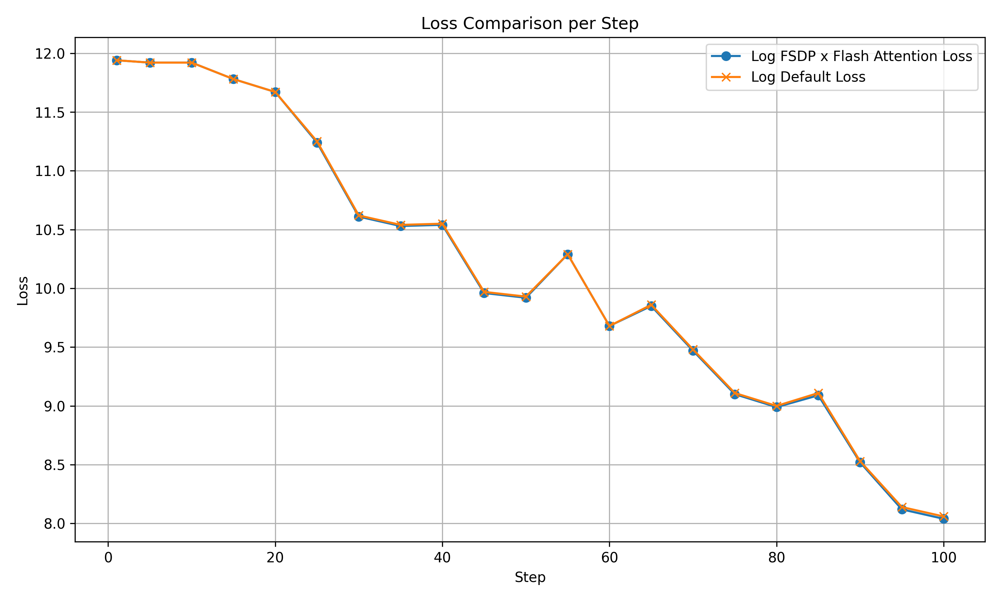
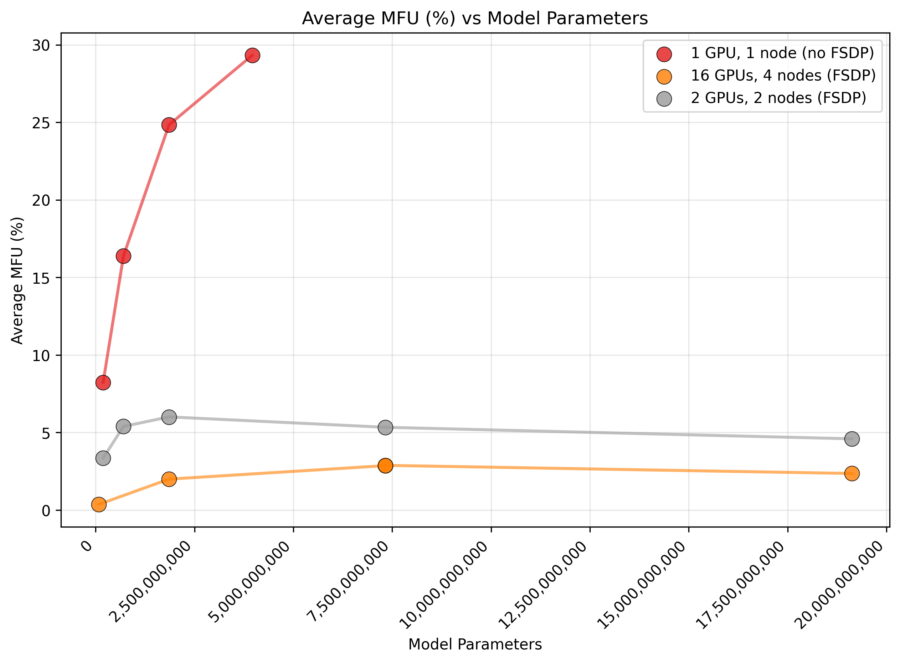
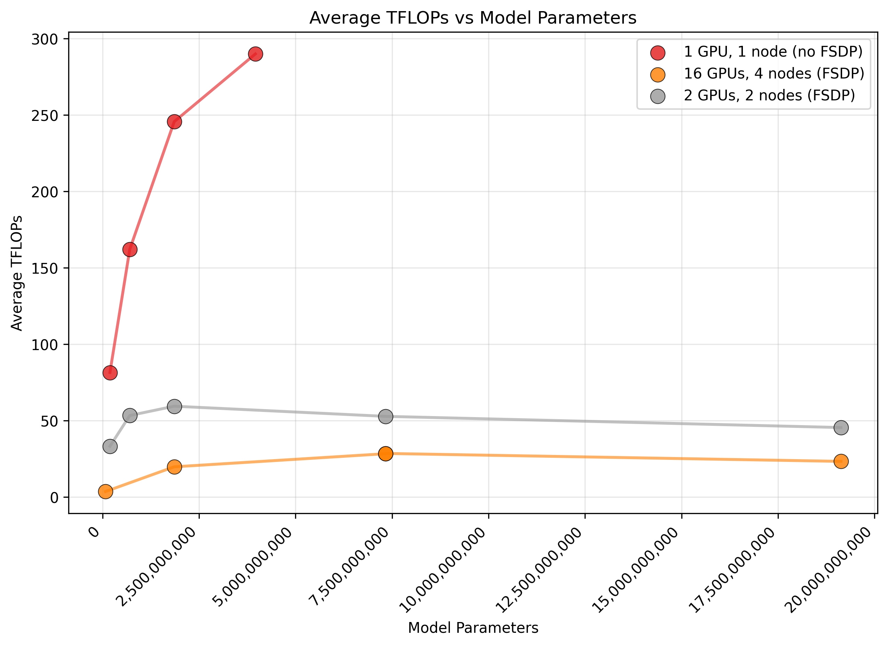
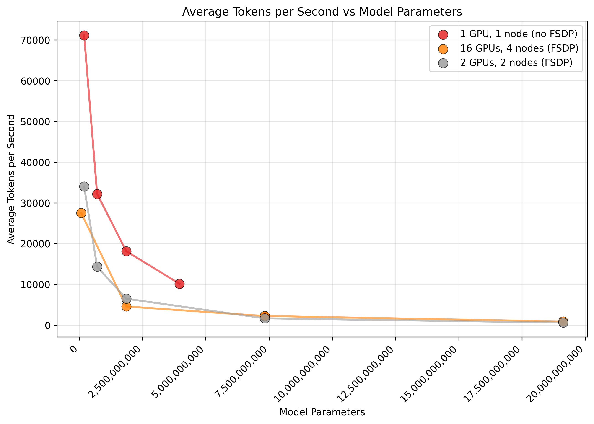
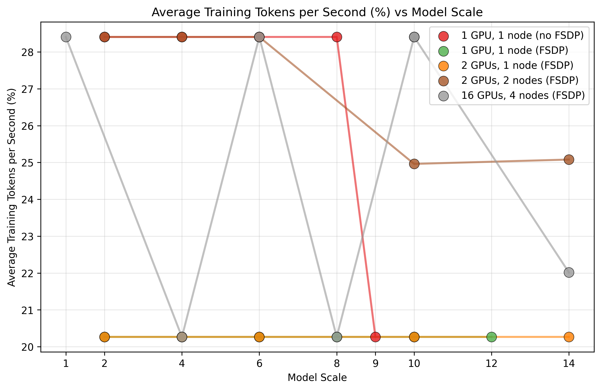
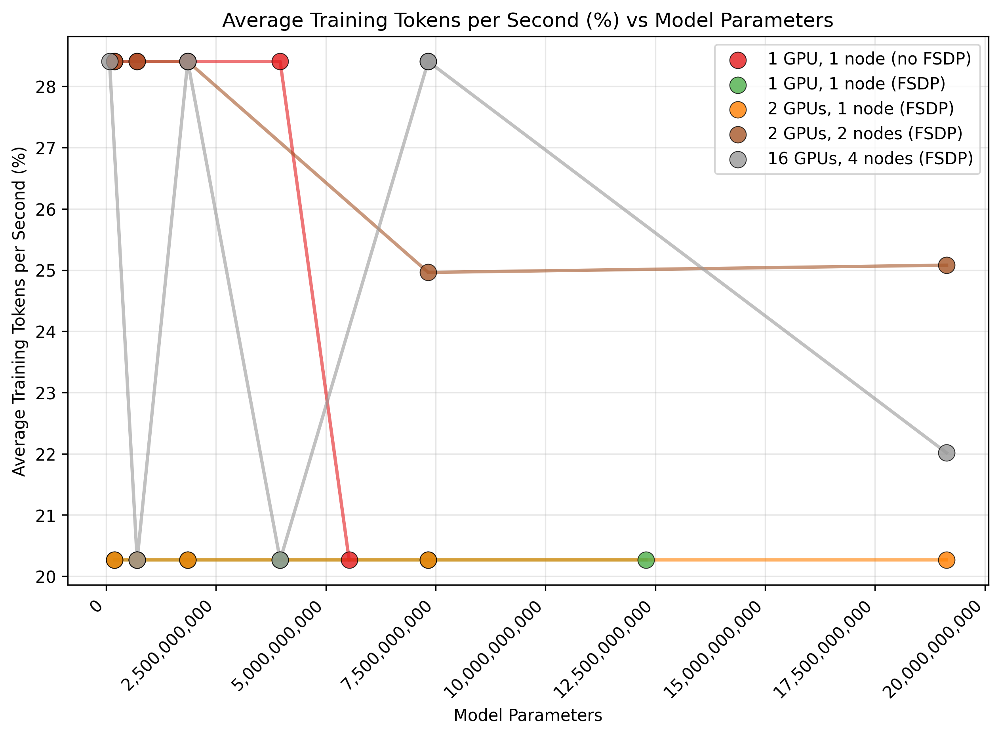
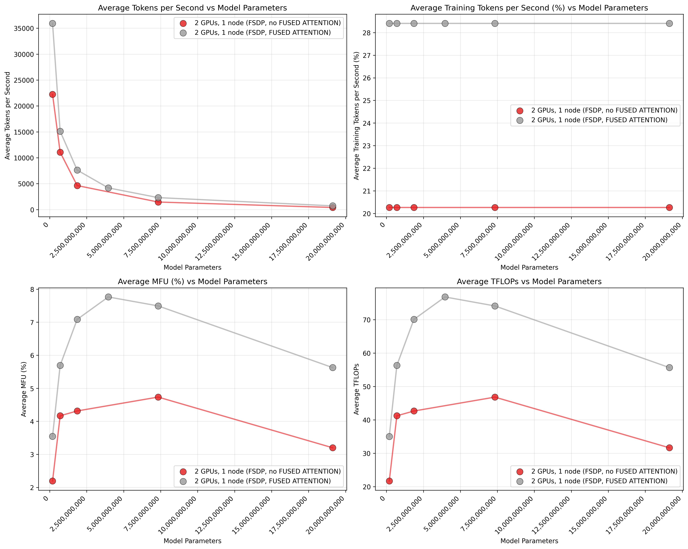

# Large Scale AI Engineering Merger: FSDP x Flash Attention 

This repository contains the project for the ETH course Large-Scale AI Engineering. It implements a merger of two features — **Fully Sharded Data Parallel (FSDP)** and **Flash Attention** — for a Transformer model and runs experiments on a multi-GPU cluster.

To view the features separately, see the `feature-fsdp` and `feature-flash-attention` branches, respectively.
We also decided not to repeat the desciption of all the features here, so please consult respective reports for more details about each individual fuature. 

## Project Structure
- `sbatch_files/` — contains Slurm job scripts

- `*.py` — training, evaluation, and model code

-  `logs/` — output logs (written per job)

## Getting Started 
For convinience, we explicitely provide the environment file `ngc_pt_jan.toml`.
To make it work with the experiments, run the following command:
```
$ mkdir -p ~/.edf/
$ cp ngc_pt_jan.toml ~/.edf/.
```

Then you can just specify `#SBATCH --environment=ngc_pt_jan` in sbatch files. 


## Running Merged Experiments

Please use the `sbatch_files/train_flash_attention_fsdp.sh` file to run merged experiments. 

To control the number of GPUs for FSDP implementation, specify the required number of GPUs via SBATCH directives (it will be equal to `nodes` × `gpu_per_node`).

To control other experiment settings, there are several new flags/arguments you can use:

- `--fused-attention` -- a flag to enable fused attention (from Flash Attention feature)
- `--scaling-factor 10` -- an argument to control the model's scaling factor: 1 represents a very small model, 14 represents the biggest model we can train with FSDP on multiple GPUs (from FSDP feature)
- `--scaling-strategy all` -- an argument to choose between two scaling strategies; the default (recommended) option `all` will scale all parameters simultaneously (from FSDP feature)
- `--set-seed 42` -- sets the seed to the specified value (from FSDP feature)

Finally, to run an experiment, simply execute:
```
sbatch sbatch_files/train_flash_attention_fsdp.sh
```

The corresponding log files will appear in the `logs/train_flash_attention_fsdp/` folder. 

## Running Individual Experiments 
Use `sbatch_files/flash_attention.sh`, `sbatch_files/train_fsdp.sh`, or `sbatch_files/train_no_fsdp.sh` to train a model with only flash attention, only FSDP, or neither.

## Loss ablation with FSDP x Flash Attention and without 
To prove the correctness of the merger, we fix the seed and train the same model with FSDP (trained on 1 nodes with 2 GPUs each) and Flash Attention or with neither (the default version). We chose the model with 3,959,687,168 parameters (scaling factor = 8).
 Then we compare the loss values parsed from the log files.  

**FSDP x Flash Attention log file**: `logs/train_flash_attention_fsdp/lsai-466275.out` \
**Default log file**: `logs/train_no_fsdp/lsai-466292.out`

**Results**:


```
=== Max Loss Difference ===
Step: 95
Log FSDP x Flash Attention Loss: 8.1200
Log Deafult Loss: 8.1400
Absolute Difference: 0.0200

=== Mean Metrics ===
Log FSDP x Flash Attention:
  tokens_per_sec: 3990.82
  training_tokens_pct: 27.98
  mfu: 7.39
  tflops: 73.12
Log Default:
  tokens_per_sec: 9857.38
  training_tokens_pct: 27.98
  mfu: 28.50
  tflops: 281.82
```

As we can see, the results are almost identical (with the biggest difference in loss values of 0.02) proving the correct implementation of the merger. 

**Implementation**: `loss_ablation.py` \
**Reproduction**: \
Activate a conda environment:
```bash
$ conda activate 
```

And run: 
```bash
$ python loss_ablation.py  --merger-logs=logs/train_flash_attention_fsdp/lsai-466275.out --default-logs=logs/train_no_fsdp/lsai-466292.out
```

## Model Scaling Experiments

To see the combined effects, we train on 2 GPUs with an increasing model size, to compare to the results using only FSDP. All runs were successful.


| # total GPUs | # nodes | scaling factor | # model parameters | log file                                         |
| ------------ | ------- | -------------- | ------------------ | ------------------------------------------------ |
| 2            | 1       | 2              | 190,857,728        | logs/train_flash_attention_fsdp/lsai_scale2.out  |
| 2            | 1       | 4              | 704,709,632        | logs/train_flash_attention_fsdp/lsai_scale4.out  |
| 2            | 1       | 6              | 1,856,128,512      | logs/train_flash_attention_fsdp/lsai_scale6.out  |
| 2            | 1       | 8              | 3,959,687,168      | logs/train_flash_attention_fsdp/lsai_scale8.out  |
| 2            | 1       | 10             | 7,329,958,400      | logs/train_flash_attention_fsdp/lsai_scale10.out |
| 2            | 1       | 14             | 19,128,929,792     | logs/train_flash_attention_fsdp/lsai_scale14.out |

**Implementation**: `plots.py` \
**Replication**: \
Activate a conda environment:
```bash
$ conda activate 
```

Install `seaborn` if necessary:
```bash
$ pip install seaborn
```

And run: 
```bash
$ python plots.py
```

**Result**

<!-- 



 -->


## Analysis

We observe that fused attention offers substantial performance improvements in FSDP training, especially for small to mid-sized models, by increasing hardware utilization and throughput. We gain a MFU of around 3 percent points and around 25 more TFLOPs, and this stays roughly constant accross model sizes.

Note that the improvement that fused attention brings is much more significant than with standard (no FSDP) training, where it only brings marginal improvements for similar model sizes (10B parameters). We assume that this is because of the distributed model of FSDP, where there is a lot of communication overhead, so overall compute is underutilized in comparison. Optimizing attention could leave space to do more work and thus improve utilization. 