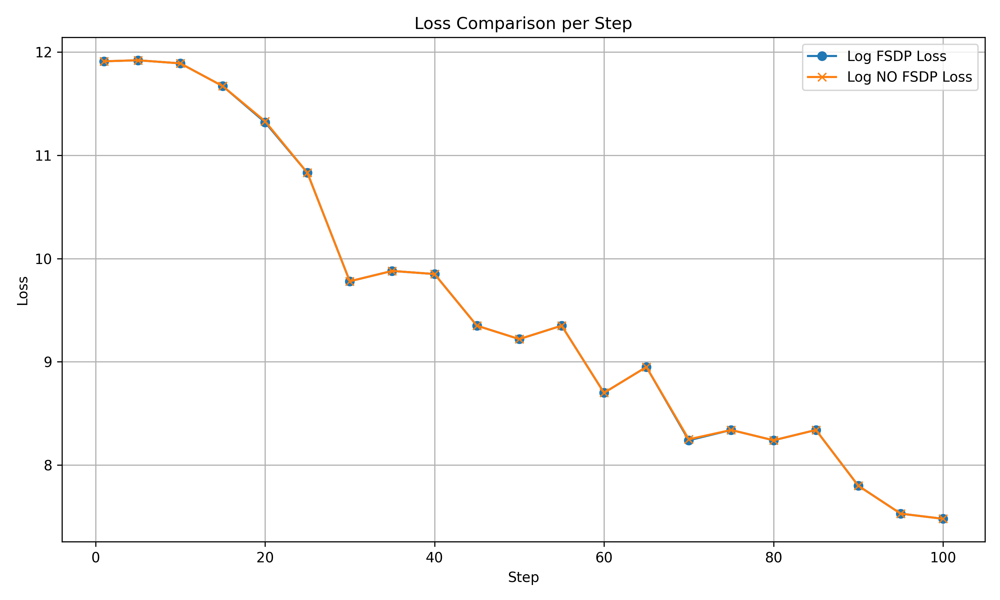
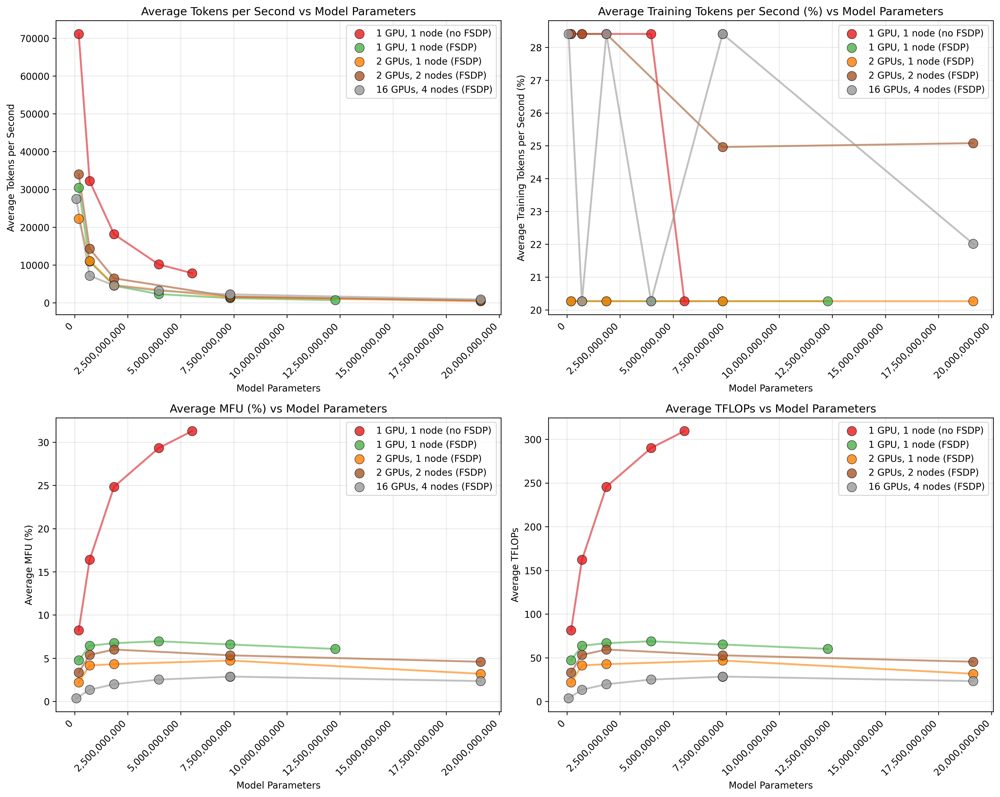
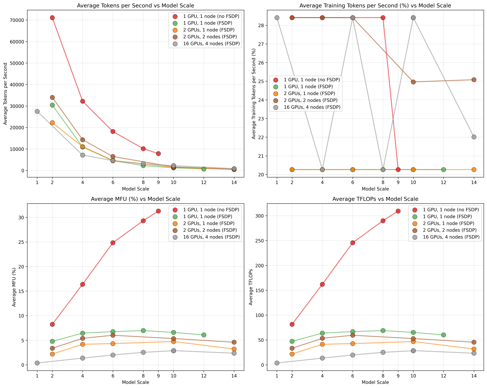

# Large Scale AI Engineering – FSDP Project

This repository contains the project for the ETH course **Large Scale AI Engineering**. It implements **Fully Sharded Data Parallel (FSDP)** training for a Transformer model and runs experiments on a multi-GPU cluster.

Project code is available on [GitHub](https://github.com/baraql/lai-proj/tree/feature-fsdp) 


## Project Structure
- `sbatch_files/` — contains Slurm job scripts

- `*.py` — training, evaluation, and model code

-  `logs/` — output logs (written per job)


## Introduction

Fully Sharded Data Parallel (FSDP) is a distributed training paradigm introduced by Meta AI [[1]](https://arxiv.org/abs/2304.11277) that enables efficient training of large AI models by sharding model parameters, gradients, and optimizer states across all participating GPUs. Unlike Distributed Data Parallel (DDP) which replicates the full model on each device, FSDP stores only a fraction of parameters on each GPU during idle periods, dramatically reducing memory requirements. During computation, FSDP employs a communication strategy where parameters are gathered only when needed for the forward or backward pass and immediately released afterward. This approach addresses key limitations in scaling model training: GPU memory constraints that prevent fitting billion-parameter models, communication bottlenecks from parameter synchronization, and suboptimal resource utilization.

Our project implements FSDP with three primary experimental objectives: (1) establish baseline memory constraints by finding the maximum model size that fits on a single GPU without FSDP; (2) validate FSDP correctness through loss ablation studies comparing training with and without FSDP on identical model architectures; and (3) analyze scaling behavior by measuring training metrics as model size and GPUs number increase when using FSDP. 

## Getting Started
For convinience, we explicitely provide the environment file `ngc_pt_jan.toml`.
To make it work with the experiments, run the following command:
```
$ mkdir -p ~/.edf/
$ cp ngc_pt_jan.toml ~/.edf/.
```

Then you can just specify `#SBATCH --environment=ngc_pt_jan` in sbatch files. 


## Scaling strategy 

To run FSDP experiments, we need to control the model's scale to determine how large a model we can train and how it affects overall performance.  
We implement two scaling strategies: `--scaling-strategy all` and `--scaling-strategy n_layers`, which can be passed as arguments to `train.py` or `train_fsdp.py`.

The first strategy scales all parameters (`dim`, `n_layers`, `n_heads`) simultaneously, starting with a minimal example (`dim=256`, `n_layers=8`, `n_heads=8`). This approach allows us to achieve a more or less balanced architecture at any scale.

The second strategy scales only the number of layers (starting with `n_layers=32`), keeping the other parameters at their default values. This allows for finer-grained control over the model's size, as only one factor is varied.

**Implementation**: `model.py`

## FSDP implementation
Similar to `train.py`, we provide `train_fsdp.py`, which supports FSDP. 
We used the following sources to ensure correct implementation:

-[PyTorch Tutorial](https://docs.pytorch.org/tutorials/intermediate/FSDP_advanced_tutorial.html) \
-[Ohio Supercomputer Center Tutorial](https://www.osc.edu/resources/getting_started/howto/howto_pytorch_fully_sharded_data_parallel_fsdp) \
-[Medium Tutorial](https://medium.com/@kyeg/unlock-multi-gpu-finetuning-secrets-huggingface-models-pytorch-fsdp-explained-a58bab8f510e) \
-[UZH Example Installations for Python-based Machine Learning Programming on GPU Nodes](https://gitlab.uzh.ch/s3it/docs/-/blob/issue80/docs/cluster/python_gpu_example.md?ref_type=heads)

**Implementation**: `train_fsdp.py` \
**Sbatch file**: `sbatch_files/train_fsdp.sh` \


## Experiment 1: maximum model size that fits on a single GPU without FSDP 

First, we establish the biggest model that can fit into a single GPU wihtout FSDP. For that we run a binary search scaling model's parameters until we find the best fit. We also implemented another scaling strategy that only changes the number of layers, allowing for more flexibility and therefore fitting a bigger model at the expense of its architecture. 

**Results**:
Scaling all parameters, the biggest model has **46,322,328,320** parameters, achieved with scaling_factor=19 (dim=4864, n_layers=152, n_heads=152). Scaling only the number of layers, the biggest model has **48,185,937,920** parameters, achieved with dim=4096, n_layers=216, n_heads=32. We decided to conduct all the future experiments with only one scaling strategy (scalign all parameters) to 

**Implementation**: `load_model_no_fsdp.py` \
**Sbatch file**: `sbatch_files/load_model_no_fsdp.sh` \
**Log files**: `logs/load_model_no_fsdp/lsai-453992.out` (scaling all parameters), `logs/load_model_no_fsdp/lsai-454054.out` (scaling only the number of layers)

However, fitting a model into a single GPU doesn't guarantee that there is enough memory to train it. We were only able to scale the model up to 9 times (`--scaling-strategy all`) in a way that still allowed training without encountering an OOM (Out of Memory) error (see Experiment 3 for more details).

## Experiment 2: loss ablation with FSDP and without FSDP 
To prove the correctness of FSDP implementation, we fix the seed and train the same model with FSDP (trained on 2 nodes with 4 GPUs each) or without FSDP. Then we compare the loss values parsed from the log files.  

**Results**:

```
=== Max Loss Difference ===
Step: 20
Log FSDP Loss: 11.3200
Log NO FSDP Loss: 11.3300
Absolute Difference: 0.0100

=== Mean Metrics ===
Log FSDP:
  tokens_per_sec: 4814.07
  training_tokens_pct: 27.98
  mfu: 6.08
  tflops: 60.09
Log NO FSDP:
  tokens_per_sec: 7515.06
  training_tokens_pct: 23.94
  mfu: 39.16
  tflops: 387.34
```

As we can see, the results are indentical (with the biggest difference in loss values of 0.01) proving the correct implementation of FSDP. 

**Implementation**: `loss_ablation.py` \
**Reproduction**: \
Activate a conda environment:
```bash
$ conda activate 
```

And run: 
```bash
$ python loss_ablation.py --fsdp-logs=/users/elyulina/scratch/lai-proj/logs/loss_ablation_fsdp/lsai-454149.out --no-fsdp-logs=/users/elyulina/scratch/lai-proj/logs/loss_ablation_no_fsdp/lsai-454162.out
```

## Experiment 3: impact of model's size and number of GPUs on training metrics

With this experiment, we aim at showing the impact of the model's size and the number of GPUs on training metrics such as: 
- Tokens per second
- Training tokens per second (%)
- MFU 
- TFLOPs

For each number of GPUs, we start scaling the model until we get the OOM error, logging the training metrics for each scale. 

Here are the corresponding log files:
| # total GPUs  | # nodes | scaling factor | # model parameters | log file                           |  success?    |
| -----------   | ------- | -------------- | ------------------ | ---------------------------------- | -------------|
| 1 (No FSDP)   | 1       | 2              | 190,857,728        | logs/train_no_fsdp/lsai-460955.out | ✅           |
| 1 (No FSDP)   | 1       | 4              | 704,709,632        | logs/train_no_fsdp/lsai-460958.out | ✅           |
| 1 (No FSDP)   | 1       | 6              | 1,856,128,512      | logs/train_no_fsdp/lsai-460959.out | ✅           |
| 1 (No FSDP)   | 1       | 8              | 3,959,687,168      | logs/train_no_fsdp/lsai-460964.out | ✅           |
| 1 (No FSDP)   | 1       | 9              | 5,530,523,904      | logs/train_no_fsdp/lsai-466006.out | ✅           |
| 1 (No FSDP)   | 1       | 10             | 7,329,958,400      | logs/train_no_fsdp/lsai-465987.out | ❌ (OOM)     |
| 1 (FSDP)      | 1       | 2              | 190,857,728        | logs/train_fsdp/lsai-465937.out    | ✅           |
| 1 (FSDP)      | 1       | 4              | 704,709,632        | logs/train_fsdp/lsai-465938.out    | ✅           |
| 1 (FSDP)      | 1       | 6              | 1,856,128,512      | logs/train_fsdp/lsai-465940.out    | ✅           |
| 1 (FSDP)      | 1       | 8              | 3,959,687,168      | logs/train_fsdp/lsai-465943.out    | ✅           |
| 1 (FSDP)      | 1       | 10             | 7,329,958,400      | logs/train_fsdp/lsai-465948.out    | ✅           |
| 1 (FSDP)      | 1       | 12             | 12,281,515,008     | logs/train_fsdp/lsai-465955.out    | ✅           |
| 1 (FSDP)      | 1       | 13             | 15,581,486,336     | logs/train_fsdp/lsai-465996.out    | ❌ (OOM)     |
| 2  (FSDP)     | 1       | 2              | 190,857,728        | logs/train_fsdp/lsai-466053.out    | ✅           |
| 2  (FSDP)     | 1       | 4              | 704,709,632        | logs/train_fsdp/lsai-466061.out    | ✅           |
| 2  (FSDP)     | 1       | 6              | 1,856,128,512      | logs/train_fsdp/lsai-466064.out    | ✅           |
| 2  (FSDP)     | 1       | 10             | 7,329,958,400      | logs/train_fsdp/lsai-466075.out    | ✅           |
| 2  (FSDP)     | 1       | 14             | 19,128,929,792     | logs/train_fsdp/lsai-466085.out    | ✅           |
| 2  (FSDP)     | 1       | 15             | 23,184,940,800     | logs/train_fsdp/lsai-466097.out    | ❌ (OOM)     |
| 2  (FSDP)     | 2       | 2              | 190,857,728        | logs/train_fsdp/lsai-461379.out    | ✅           |
| 2  (FSDP)     | 2       | 4              | 704,709,632        | logs/train_fsdp/lsai-461380.out    | ✅           |
| 2  (FSDP)     | 2       | 6              | 1,856,128,512      | logs/train_fsdp/lsai-461406.out    | ✅           |
| 2  (FSDP)     | 2       | 10             | 7,329,958,400      | logs/train_fsdp/lsai-461407.out    | ✅           |
| 2  (FSDP)     | 2       | 14             | 19,128,929,792     | logs/train_fsdp/lsai-461412.out    | ✅           |
| 2  (FSDP)     | 2       | 15             | 23,184,940,800     | logs/train_fsdp/lsai-466000.out    | ❌ (OOM)     |
| 16 (FSDP)     | 4       | 1              | 75,501,824         | logs/train_fsdp/lsai-461073.out    | ✅           |
| 16 (FSDP)     | 4       | 2              | 190,857,728        | logs/train_fsdp/lsai-460981.out    | ✅           |
| 16 (FSDP)     | 4       | 4              | 704,709,632        | logs/train_fsdp/lsai-466027.out    | ✅           |
| 16 (FSDP)     | 4       | 6              | 1,856,128,512      | logs/train_fsdp/lsai-460997.out    | ✅           |
| 16 (FSDP)     | 4       | 8              | 3,959,687,168      | logs/train_fsdp/lsai-466036.out    | ✅           |
| 16 (FSDP)     | 4       | 10             | 7,329,958,400      | logs/train_fsdp/lsai-461014.out    | ✅           |
| 16 (FSDP)     | 4       | 14             | 19,128,929,792     | logs/train_fsdp/lsai-461015.out    | ✅           |
| 16  (FSDP)    | 4       | 15             | 23,184,940,800     | logs/train_fsdp/lsai-466014.out    | ❌ (OOM)     |


Note that some long computations were stopped early once there were enough steps to obtain the average value. 
Next, we plot the results for each metric (see the next section).

**Implementation**: `plots.py` \
**Replication**: \
Activate a conda environment:
```bash
$ conda activate 
```

Install `seaborn` if necessary:
```bash
$ pip install seaborn
```

And run: 
```bash
$ python plots.py
```

**Result**

<!-- 


 -->




## FSDP Scaling Analysis


### Single GPU Performance: FSDP vs Non-FSDP

Our experiments reveal striking differences in model capacity even with a single GPU. Without FSDP, we can scale up to a 9x configuration, achieving a maximum of **5,530,523,904 parameters**. However, when using FSDP on the same single GPU, we can scale up to 12x, reaching **12,281,515,008 parameters** – more than double the capacity.

This significant improvement occurs despite FSDP falling back to `NO_SHARD` mode, as indicated by the warning: `UserWarning: FSDP is switching to use NO_SHARD instead of ShardingStrategy.FULL_SHARD since the world size is 1`. This could be explained by some internal FSDP optimizations.

### Multi-GPU Scaling Benefits

The advantages of FSDP become even more pronounced with multiple GPUs. With **2 GPUs**, we can accommodate models with at least **19,128,929,792 parameters** (14x scaling factor), representing nearly a **4x increase** compared to the single-GPU non-FSDP baseline. This demonstrates that our FSDP implementation functions correctly and provides substantial scaling benefits.

### Scaling Limitations and Wrapping Strategy

Interestingly, increasing GPU count beyond 2 does not yield proportional improvements in model capacity. This limitation stems from our FSDP wrapping policy, which follows the recommended approach from the [PyTorch official FSDP tutorial](https://docs.pytorch.org/tutorials/intermediate/FSDP_advanced_tutorial.html). Our strategy wraps individual transformer blocks, which appears to be optimal up to the 14x scaling factor.

This suggests that the wrapping granularity becomes a bottleneck beyond a certain model size, where the overhead of managing numerous small shards outweighs the memory benefits. Alternative wrapping strategies (such as wrapping larger components or using different sharding policies) might be necessary for scaling beyond this threshold, though exploring these approaches is beyond the scope of this project.

To further validate this limitation, we conducted additional experiments using the maximum available number of GPUs (16) to confirm our findings and assess the communication overhead at scale.

### Communication Overhead Analysis

To investigate the impact of inter-node communication, we conducted experiments comparing training performance on the same number of GPUs distributed across different node configurations. Specifically, we compared:
- **2 GPUs on 1 node** (intra-node communication)
- **2 GPUs on 2 nodes** (inter-node communication)

As expected, the training metrics clearly show increased communication overhead when GPUs are distributed across separate nodes, which is especially prominent for smaller models. This confirms that network topology matters for FSDP performance and that keeping GPUs on the same node is preferable when possible.

Overall, from our results, we see that FSDP average training throughput remains stable across model scales. However, FSDP significantly reduces hardware efficiency—both MFU and TFLOPS drop sharply, leading to lower absolute throughput and underutilized GPU resources at larger model scales.

